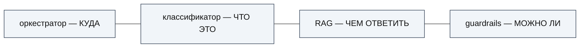
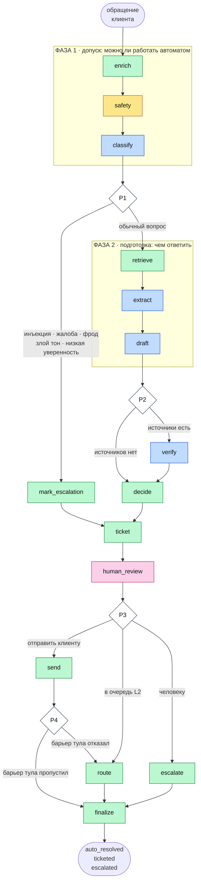
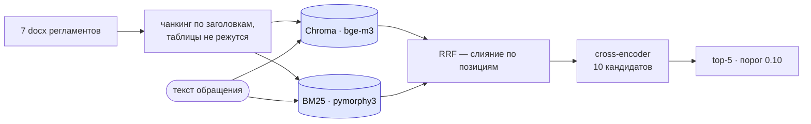
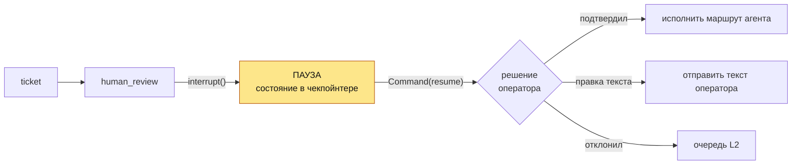
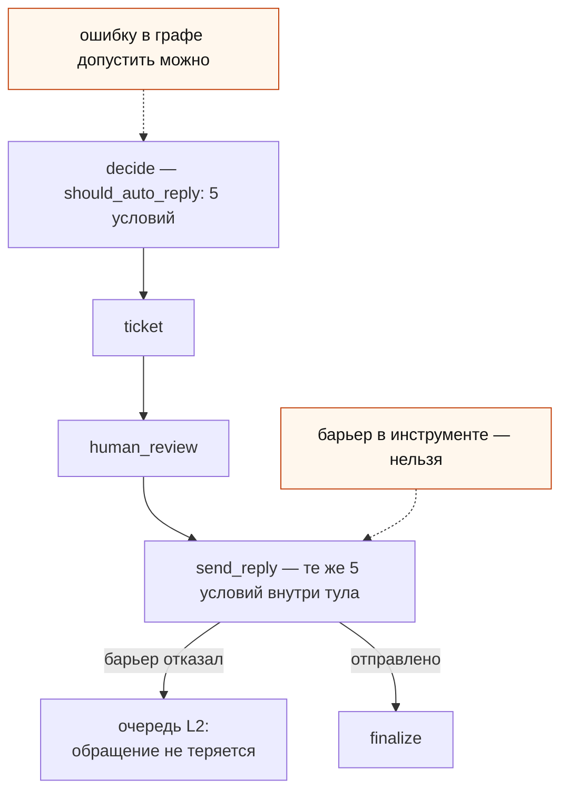

# AI-агент обработки клиентских обращений банка

Дипломный проект курса **AgentOps 4.0**. Агент принимает обращение клиента,
понимает его, находит ответ в регламентах банка и либо отвечает сам, либо
передаёт человеку — по правилам, заданным кодом, а не решением модели.

Рабочий артефакт — [`bank_support_agent.ipynb`](bank_support_agent.ipynb):
single-agent на LangGraph, 15 узлов, 4 условные развилки, 11 инструментов.

---

## 1. Задача

Крупный розничный банк: **≈8000 обращений в сутки** из 5 каналов (чат
приложения, интернет-банк, e-mail, веб-форма, мессенджеры), ≈120 операторов
первой линии.

Как было до агента: ручная классификация 3–4 минуты на обращение, точность
маршрутизации ≈82% (15–20% «футбол» между очередями), время первого ответа в
пик 35–40 минут при SLA 15 минут, первая линия закрывает ≈55% без эскалации.

Что должен делать агент:

- классифицировать обращение и направить в нужную очередь;
- приложить к тикету саммари, извлечённые сущности и черновик ответа;
- типовые вопросы по регламенту закрывать автономно, со ссылкой на источник;
- **всё, что выходит за границы доверия, передавать человеку** — финансовые
  действия, жалобы, подозрение на мошенничество, низкая уверенность.

Целевые метрики ТЗ: routing accuracy ≥95% (macro-F1), containment 30–40%,
false-resolve <2%, время автоответа <1 минуты.

---

## 2. Архитектура

### Формула разделения ответственности

На ней держится весь дизайн (дословно из ТЗ):



Каждый компонент отвечает на один вопрос и не лезет в чужой. Классификатор не
выбирает маршрут, RAG не решает, отправлять ли ответ, guardrails не выбирают
категорию.

### Граф агента

Прямоугольник — узел (делает работу и пишет результат в состояние), ромб —
развилка (только выбирает ветку, ничего не меняет), подпись на стрелке —
условие перехода.



**Синие узлы вызывают модель** — только они стоят времени и только они могут
выдумать. Жёлтый — барьер безопасности на регулярных выражениях, без модели.
Зелёные — действия и записи решений. Розовый — единственная точка, где систему
останавливает человек.

**Модель нигде не выбирает маршрут.** Все четыре развилки — обычные `if` по
полям состояния. Это обязательное условие для регулируемого домена: маршрут
обязан быть воспроизводимым и объяснимым.

**Тикет создаётся на любом пути**, включая автоответ — требование ТЗ, —
и идемпотентно: повтор узла вернёт тот же `ticket_id`.

---

## 3. Функциональные блоки

Разделы ноутбука идут в том же порядке, в каком обращение проходит систему.
Каждый открывается парой «роль в системе / чем реализовано».

| § | блок | роль | ключевые технологии |
|---|---|---|---|
| 0 | Окружение | где выполняется модель | Ollama, `openai` SDK |
| 1 | Вход | обращение из любого канала → один типизированный объект | Pydantic-контракт с валидаторами |
| 2 | Классификатор | «что это за обращение» | structured output, `json_schema` + `strict` |
| 3 | База знаний | «чем отвечать» | Chroma + BM25 + RRF + cross-encoder |
| 4 | Инструменты действия | что агент делает во внешнем мире | контракт `ToolResult`, идемпотентность, guardrails, DLP, kill switch |
| 5 | Инструменты генерации | что агент пишет и как это проверяется | structured output + детерминированные барьеры |
| 6 | Оркестратор | как из функций получается агент | LangGraph `StateGraph`, редюсеры, `RetryPolicy` |
| 7 | Человек в контуре | пауза перед необратимым действием | `interrupt()`, `Command(resume=...)`, чекпойнтер |
| 8 | Сборка и запуск | граф целиком, точка входа, трейсинг | — |
| 9–15 | Эксплуатация | Evals, Observability, FinOps, надёжность, 152-ФЗ, экономика, runbook | — |

### Вход

Пять каналов приходят в разных форматах. Адаптер приводит их к одному
`IncomingRequest` — дальше внутрь системы разнообразие внешнего мира не
проникает, и ни один узел не содержит `if channel == ...`.

Разметка датасета (правильные ответы) в агента **не передаётся вообще**: между
агентом и эталоном проходит граница файла, а не соглашение. Иначе метрики
качества были бы фикцией.

### Классификатор

Превращает текст в структуру из семи полей: категория (10 значений),
подкатегория (20), сложность, приоритет, тональность, уверенность, саммари.

Ответ принуждается схемой на уровне декодирования (`response_format` с
`json_schema` и `strict: true`) — модель физически не может вернуть значение
вне перечня. Та же Pydantic-схема служит валидатором ответа: пишется один раз,
работает в обе стороны.

Порядок полей значим: `summary` и `tone` идут перед `category`, поэтому модель
сначала формулирует суть своими словами и лишь затем выбирает ярлык.

### База знаний (RAG)



Вектор понимает смысл, BM25 — точные слова (номер тарифа, «СБП», номер счёта).
RRF сливает выдачи по местам в списке, а не по несопоставимым шкалам (косинус
лежит в 0…1, BM25 не ограничен). Реранкер дорогой, поэтому смотрит только на 10
отобранных кандидатов, а не на всю базу.

Чанкинг сделан по структуре документа, а не по числу символов: **таблицы не
режутся никогда** — именно в них лежат ставки и комиссии, ради которых поиск и
нужен.

### Инструменты

11 инструментов по ТЗ, у всех общий контракт `ToolResult(ok / degraded /
error)` — инструмент не бросает исключений наружу. `degraded` — отдельное
состояние: «CRM недоступна, работаем без обогащения» это не отказ обработки.

| инструмент | назначение |
|---|---|
| `classify_request` | классификация обращения |
| `search_knowledge_base` | поиск по регламентам |
| `detect_safety_issues` | инъекции, токсичность, язык, PII на входе |
| `enrich_client_context` | профиль клиента из CRM (только чтение) |
| `create_ticket` | тикет, идемпотентно |
| `route_ticket` | очередь L2 и SLA |
| `send_reply` | автоответ клиенту (за пятью барьерами) |
| `escalate_to_human` | задача человеку |
| `extract_entities` | сумма, дата, карта, получатель |
| `draft_reply` | черновик ответа по источникам |
| `check_grounding` | проверка обоснованности |

### Защита от выдумки

Три независимых приёма, все — **детерминированные**, без второй модели:

1. **Извлечение сущностей** по определению не создаёт информации: всё, что
   модель вернула, обязано находиться в исходном тексте. Проверяется вхождением
   подстроки; не нашлось — поле очищается.
2. **Черновик ссылается на номера** фрагментов из пронумерованного списка, а не
   на идентификаторы. Номер из короткого списка выдумать труднее, сопоставление
   номер → источник делает код.
3. **Судья обоснованности** раскладывает черновик на утверждения и к каждому
   даёт дословную цитату. У него **нет поля «вердикт»** — итог считает код,
   проверив каждую цитату вхождением в текст источников.

### Человек в контуре



Граф действительно останавливается: процесс может завершиться, состояние
лежит в чекпойнтере под ключом `thread_id = request_id`. Закрыты оба паттерна
курса — Approval (подтвердить/отклонить) и Edit (оператор правит черновик).

Тонкость реализации: после `interrupt()` узел при возобновлении
перезапускается **с первой строки**, поэтому до прерывания в нём только чтение
состояния — ни записей, ни уведомлений, иначе они сработают дважды.

### Двойной барьер автоответа

Единственное необратимое действие агента — отправка ответа клиенту. Поэтому
одни и те же пять условий проверяются дважды и независимо: **граф выбирает
маршрут, инструмент защищает действие**.



Пять условий: черновик подтверждён источниками, сложность `simple`, категория в
allow-list, достаточная поддержка источниками, обращение на русском. Четвёртая
развилка ловит стык: граф решил отправить, барьер инструмента отказал —
обращение уходит в очередь L2, а не теряется.

---

## 4. Модели и библиотеки

| что | модель / библиотека | зачем именно она |
|---|---|---|
| Генерация и классификация | **`qwen2.5:7b`** (Q4_K_M) через Ollama | замер на 50 обращениях: 7B против 1.5B дали одинаковую точность категории (92%), но у 1.5B **24% ответов путали поля схемы** против 0% у 7B — решило именно это |
| Эмбеддинги | **`bge-m3`** | многоязычная, работает с русским |
| Реранкер | **`BAAI/bge-reranker-v2-m3`** | cross-encoder: оценивает пару «запрос-документ» целиком |
| Лексический поиск | `rank_bm25` + `pymorphy3` | лемматизация обязательна для русского: «вклады» и «вкладу» должны совпасть |
| Векторное хранилище | `chromadb` | нативная фильтрация по метаданным и персистентность |
| Оркестрация | `langgraph` | графы вместо цепочек: ветвления, retry, пауза, возобновление |
| Контракты | `pydantic` | схема как принуждение для модели и как валидатор ответа |

**Инференс полностью локальный.** Это не только про стоимость: текст обращения
и профиль клиента содержат персональные данные и не должны покидать периметр
банка. Ollama даёт OpenAI-совместимый API, поэтому переход на облачную модель —
замена `base_url`, а не переписывание логики.

---

## 5. Ключевые решения

Полный журнал — [`Roadmap.md`](Roadmap.md), 116 записей с отвергнутыми
альтернативами. Здесь — те, что определяют облик системы.

**Workflow, а не ReAct и не мультиагент.** Путь обращения в ТЗ расписан как
последовательность с ветвлениями — маршрут уже известен. Отдавать известный
маршрут на решение модели значит платить недетерминизмом за ненужную гибкость.
В учебном ReAct-примере модель вызывает платёжный инструмент напрямую; наш
`send_reply` — такое же необратимое действие, и между решением модели и
физической отправкой обязан стоять барьер, не завязанный на согласие модели.

**Реакция на нарушение инварианта — эскалация, а не исключение.** Исключение
защищает программиста (падаем громко), эскалация защищает клиента (обращение
всё равно попадёт к человеку). Для банка верно второе.

**Порог обоснованности — не доля, а прямое правило.** Ориентир курса
faithfulness ≥ 0.85 неприменим на коротком ответе: доля принимает значения
`k/n`, и при `n ≤ 6` порог 0.85 тождественно равен 1.0. Держать его как долю
значило бы делать вид, что допуск мягче, чем он есть. Правило сформулировано
прямо: **ни одного неподтверждённого утверждения по регламенту**; доля
считается и уходит в трейс как диагностика.

**Каскад моделей проверен и отвергнут данными.** Гипотеза «мелкая модель на
дешёвых задачах» замерена: на проверке обоснованности `qwen2.5:1.5b` совпала с
7B лишь в 6 случаях из 15, и больше половины расхождений — в опасную сторону
(«подтверждено» там, где 7B правильно отверг). Отрицательный результат — тоже
результат.

**Кэш вместо каскада.** 59% датасета — дословные повторы 96 уникальных текстов.
При `temperature=0` кэш точного совпадения не аппроксимация, а отказ платить
дважды за один и тот же детерминированный вызов: замерено 1 реальный вызов
и 4 мгновенных попадания на реальном дубле.

**Промпты — версионируемые файлы**, а не строки в коде. Благодаря этому две
версии промпта классификатора сравнены одной функцией без правки кода, а откат
промпта в инциденте не требует переката версии.

---

## 6. Качество и безопасность

### Классификация

| замер | старый промпт | текущий |
|---|---|---|
| Macro-F1 на golden dataset (32 кейса) | 66.5% | **89.9%** |
| Macro-F1 на holdout (18 обращений вне разбора) | 74.3% | **84.0%** |
| Accuracy подкатегории | 53.1% | 87.5% |

Причина прежнего провала найдена разбором: категория `other` определялась
**отрицательно** («всё, что не попадает в перечисленное»), и модель почти
никогда её не выбирала — 8 ошибок из 8, F1 = 0.00. Помогли не примеры, а
процедура: три вопроса до выбора темы.

Few-shot проверен и **отвергнут как утечка**: датасет шаблонный (96 уникальных
текстов на 2000 обращений), и пример из обучающей части оказывается близнецом
тестового — метрика выросла бы по фальшивой причине.

Разница между 89.9% и 84.0% — **измеренная цена подгонки**: правила писались
после разбора ошибок на golden, поэтому там результат оптимистичен. Holdout
существует ровно для того, чтобы эта разница была видна. Цель ТЗ 95% не
достигнута, и это заявлено прямо.

### Безопасность

Threat model составлена **до** реализации: актив → поверхность → сценарий →
контроль. Единственная недоверенная поверхность — текст обращения.

Red-teaming на 19 атаках четырёх категорий (12 живых инъекций из датасета,
транслит-обфускация, jailbreak, social engineering): **FNR = 0%**, ни одна
атака не прошла. FPR = 25% на одной категории задокументирован как измеренный
trade-off: фраза «служба безопасности» одинаково звучит у атакующего и у
клиента, который на атаку жалуется. Различить их без модели нельзя, а это
первый и самый дешёвый слой каскада.

DLP работает на два канала: ответ клиенту (ссылка на недоверенный хост
блокирует ответ целиком — это канал эксфильтрации) и логи/трейсы (там ссылка
вырезается, а строка сохраняется, иначе DLP уничтожил бы запись о самом
инциденте). Детекторы PII общие с проверкой входа — один источник правды.

Kill switch останавливает агента без переката версии и проверяется в трёх
точках, включая единственную точку отправки: иначе обращение, вставшее на паузе
до отключения, доехало бы до клиента после.

### Evals

Три слоя от дешёвого к дорогому: детерминированные инварианты маршрутизации
(10 категорий, без единого вызова модели) → калибровка судьи ручной сверкой с
экспертом (20/22, **0 ложных принятий**) → golden dataset 32 кейса.

Quality Gate разделён на жёсткие и мягкие ворота. Жёсткие — 0 критичных по
риску кейсов мимо человека, инварианты маршрутизации, 0 ложных принятий судьи
— проходят. Мягкий `macro_f1_target` честно FAIL на 89.9% при цели 95%.

### Метрики системы

| метрика | AS-IS | цель ТЗ | замерено |
|---|---|---|---|
| Routing accuracy (macro-F1) | ≈82% | ≥95% | 89.9% / 84.0% на holdout |
| False-resolve | — | <2% | **0%** |
| RAG Hit Rate / MRR | — | — | **1.00 / 0.84** |
| Containment | — | 30–40% | 5% |
| Латентность полного пути | 3–4 мин (только классификация) | <1 мин | ≈130 с на CPU |

**Containment 5% — осознанный перекос, а не баг.** Барьер требует, чтобы
подтверждены были *все* утверждения по регламенту. Агент ошибается в безопасную
сторону: false-resolve 0% при escalation recall 83%. Для банка направление
верное, но заявленная польза (снятие нагрузки с первой линии) реализована не
полностью — это записано прямо, а не спрятано.

**Латентность упирается в железо, а не в архитектуру.** Инференс идёт на
процессоре без видеокарты (AMD Ryzen 7 5700U). Те же вычисления на GPU
выполняются в десятки раз быстрее, и требование «<1 минуты» укладывается с
запасом. Ветка эскалации уже сейчас проходит за ~15 секунд, потому что
пропускает поиск и генерацию.

---

## 7. Осознанно не сделано

Три темы отложены **решением, а не по нехватке времени** — все три требуют
инфраструктуры или процесса вне блокнота:

- **Docker** — упаковка и деплой;
- **PostgreSQL-персистентность** — `PostgresSaver` вместо `MemorySaver`;
- **MCP-сервер** — требует отдельного процесса.

Внешний коллектор трейсов (Langfuse) не подключён: вместо него локальный
span-трейсинг в духе OpenTelemetry GenAI. Точка подключения одна — узел
`finalize`, в который сходятся все ветки.

---

## 8. Как запустить

```bash
# 1. Модель (Ollama должен быть установлен и запущен: ollama serve)
ollama pull qwen2.5:7b
ollama pull bge-m3

# 2. Зависимости
pip install langgraph openai pydantic chromadb sentence-transformers \
            rank_bm25 pymorphy3 python-docx pandas

# 3. Тесты — быстрая проверка, что всё на месте (модель не вызывается)
python tests_tools.py

# 4. Агент — открыть ноутбук и выполнить ячейки по порядку
jupyter lab bank_support_agent.ipynb
```

Первый запуск дольше: скачивается реранкер (~600 МБ) и строится индекс Chroma
в `kb_index/` (в репозиторий не входит, создаётся автоматически).

Путь к проекту нигде не зашит — корень определяется поиском вверх от текущей
папки, поэтому репозиторий работает сразу после клонирования.

---

## 9. Состав репозитория

| файл | что это |
|---|---|
| [`bank_support_agent.ipynb`](bank_support_agent.ipynb) | **сам агент**: 16 разделов в порядке прохождения обращения |
| [`research_and_notes.ipynb`](research_and_notes.ipynb) | замеры и разведка данных, приведшие к решениям |
| [`Roadmap.md`](Roadmap.md) | требования, архитектура, журнал из 116 решений с отвергнутыми альтернативами |
| [`architecture_map.md`](architecture_map.md) | наглядная карта графа, состояния и барьеров |
| [`tests_tools.py`](tests_tools.py) | 13 unit-тестов на контракты инструментов, без вызовов модели |
| `prompts/<name>/vN.txt` | системные промпты, версионируются файлами |
| `bench/` | сохранённые результаты замеров; пять файлов читаются кодом ноутбука |
| `data/` | датасет 2000 обращений и база знаний (7 docx) |
| `case/` | исходные материалы курса: условия кейса и требования к реализации |
