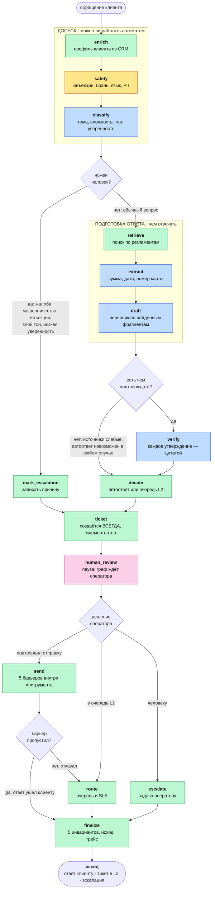

# AI-агент обработки клиентских обращений банка

Дипломный проект курса **AgentOps 4.0**.

Агент принимает обращение клиента, определяет его тему, находит ответ в
регламентах банка и либо отвечает сам, либо передаёт человеку. Решение о
маршруте принимает **код, а не модель**.

Всё содержимое — в [`bank_support_agent.ipynb`](bank_support_agent.ipynb):
15 узлов, 4 условные развилки, 11 инструментов.

---

## Задача

Банк получает ≈8000 обращений в сутки из 5 каналов; первую линию держат
≈120 операторов. Ручная классификация занимает 3–4 минуты на обращение,
точность маршрутизации ≈82%, время первого ответа в пик 35–40 минут при SLA 15.

Агент должен снять типовую нагрузку и **не навредить**: закрывать простые
вопросы по регламенту со ссылкой на источник, а всё остальное — финансовые
действия, жалобы, подозрение на мошенничество, низкую уверенность — отдавать
человеку с готовым черновиком и разобранными сущностями.

---

## Как устроен агент

Обращение проходит четыре фазы. Прямоугольник — узел (делает работу), ромб —
развилка (только выбирает ветку), подпись на стрелке — условие перехода.



**Синим отмечены четыре узла, которые вызывают модель** — только они стоят
времени и только они могут ошибиться выдумкой. Жёлтый — проверка входа на
регулярных выражениях, без модели. Зелёные — действия и записи решений.
Розовый — единственная точка, где систему останавливает человек.

### Три принципа, на которых держится дизайн

**1. Маршрут выбирает код.** Все четыре развилки — обычные `if` по полям
состояния. Модель отвечает на вопрос «что это за обращение», но не на вопрос
«что с ним делать». В регулируемом домене маршрут обязан быть воспроизводимым.

Формула из технического задания: *оркестратор решает «куда», классификатор —
«что это», RAG — «чем ответить», guardrails — «можно ли вообще»*.

**2. Необратимое действие защищено дважды.** Единственное необратимое действие
агента — отправка ответа клиенту. Пять условий проверяет граф (выбор маршрута)
и те же пять — сам инструмент `send_reply` внутри. Ошибку в графе допустить
можно, барьер в инструменте — нет. Четвёртая развилка ловит стык: если граф
решил отправить, а инструмент отказал, обращение уходит в очередь L2 и не
теряется.

**3. Тикет создаётся на любом пути**, включая автоответ, и идемпотентно:
повторный запуск узла вернёт тот же `ticket_id`. Все ветки сходятся в
`finalize` — одна точка для проверки инвариантов и для трейсинга.

---

## Технологии

| слой | чем сделано | почему так |
|---|---|---|
| Модель | **`qwen2.5:7b`** через **Ollama** | локально: текст обращения и профиль клиента содержат ПДн и не покидают периметр. Ollama даёт OpenAI-совместимый API, поэтому переход в облако — замена `base_url` |
| Структурный вывод | `response_format={json_schema, strict}` + **Pydantic** | схема принуждает модель на уровне декодирования и она же валидирует ответ: пишется один раз, работает в обе стороны |
| Оркестрация | **LangGraph** `StateGraph` | ветвления, повторы, пауза и возобновление; состояние — `TypedDict` с редюсерами |
| Пауза на человеке | `interrupt()` + `Command(resume=…)` + чекпойнтер | граф действительно останавливается: состояние переживает завершение процесса |
| Поиск | **Chroma** + `bge-m3`, **BM25** + `pymorphy3`, **RRF**, cross-encoder `bge-reranker-v2-m3` | вектор понимает смысл, BM25 — точные слова (номер тарифа, «СБП»); RRF сливает по позициям, потому что шкалы несопоставимы |
| Разбор документов | `python-docx` | чанкинг по заголовкам, **таблицы не режутся**: в них лежат ставки и комиссии |
| Наблюдаемость | **OpenTelemetry SDK**: span на узел, `trace_id`, дерево вызовов, атрибуты `gen_ai.*` | стандартный формат: подключить свой коллектор — заменить экспортёр |
| Надёжность | `RetryPolicy`, потолки шагов и времени, таймаут на вызов | подробности ниже |

### Выбор модели — по замеру, а не по умолчанию

`qwen2.5:7b` против `qwen2.5:1.5b` на 50 обращениях: точность категории
одинаковая (92%), но у младшей модели **24% ответов путали поля схемы** против
0% у старшей. Решило именно это, а не точность.

---

## На какую теорию опираемся

| приём | откуда | как применён |
|---|---|---|
| Агент как **граф**, а не цепочка | урок «Архитектура управления LangGraph» | узлы, условные рёбра, состояние с редюсерами |
| **Workflow вместо ReAct** | там же | путь обращения известен из ТЗ; отдавать известный маршрут модели — платить недетерминизмом за ненужную гибкость |
| **HITL**: Approval и Edit | там же | оператор подтверждает маршрут либо правит черновик, и правка уходит клиенту |
| **Structured output**, SGR | урок «Структурный вывод» | порядок полей значим: сначала суть и тон, потом ярлык — вывод опирается на разбор |
| **Contract-first инструменты** | урок «Tool calling» | общий `ToolResult(ok/degraded/error)`; инструмент не бросает исключений наружу |
| **RAG**: гибрид + реранкер | урок «RAG-системы» | собран полный baseline курса, чанкинг заменён на структурный |
| **Faithfulness**, LLM-as-a-judge | урок «Тестирование и Evals» | судья раскладывает ответ на утверждения; вердикт считает код |
| **Guardrails, threat model, red-teaming** | урок «Безопасность AI-агентов» | детекторы на регулярках как первый слой каскада |
| **Идемпотентность** при повторах | урок «Персистентность» | реестр ключей для тикетов и писем |

Отличия от учебных примеров зафиксированы отдельно. Главное: в ноутбуке урока
модель вызывает платёжный инструмент напрямую, без подтверждения человеком.
Наш `send_reply` — такое же необратимое действие, и между решением модели и
физической отправкой стоит барьер, не зависящий от согласия модели.

---

## Защита от выдумки

Три независимых приёма, все **детерминированные** — вторая модель не нужна:

1. **Извлечение сущностей не создаёт информации.** Всё, что модель вернула,
   обязано находиться в исходном тексте; проверка — вхождением подстроки.
   Не нашлось — поле очищается, факт попадает в трейс.
2. **Черновик ссылается на номера** фрагментов из пронумерованного списка.
   Попроси модель выдать идентификатор `doc03#017` — она его выдумает; номер
   из короткого списка выдумать труднее, а сопоставление делает код.
3. **Судья не выносит вердикт.** Он раскладывает ответ на утверждения и к
   каждому даёт дословную цитату. Итог считает код, проверив каждую цитату
   вхождением в текст источников. Числа проверяются отдельно, до вызова
   модели — самый дешёвый слой ловит самое дорогое.

Правило допуска сформулировано прямо: **ни одного неподтверждённого утверждения
по регламенту**. Ориентир курса «faithfulness ≥ 0.85» здесь неприменим: доля
принимает значения `k/n`, и при `n ≤ 6` порог 0.85 тождественно равен 1.0 —
держать его как долю значило бы делать вид, что допуск мягче, чем он есть.

---

## Надёжность

Четыре предохранителя, каждый закрывает свой класс отказа:

| предохранитель | от чего | где проверяется |
|---|---|---|
| `MAX_STEPS = 15` | зацикливание графа | три точки: две развилки и `finalize` |
| `MAX_SECONDS = 300` | долгий путь с повторами | там же |
| `RetryPolicy(3, backoff)` | недоступность внешнего сервиса | узлы, ходящие наружу |
| **таймаут на вызов модели** | зависший вызов | внутри `_structured_call` |

Последний появился не из теории. В сквозном замере одно обращение шло **три
часа**: вызов модели завис, а первые три предохранителя работают *между* узлами
и оборвать идущий вызов не могут. Таймаут превращает «висим вечно» в обычную
ошибку, которую система уже обрабатывает штатно.

Таймаут **пропорционален цене вызова**: у извлечения сущностей 60 секунд без
повтора, у остальных 180. Сущности — удобство для оператора, а не корректность;
платить за них шесть минут бюджета и эскалировать обращение из-за потраченного
времени — приоритеты наоборот.

---

## Наблюдаемость

Трассировка сделана на **OpenTelemetry SDK**, а не на самодельных записях.
У span'ов есть `trace_id`, `span_id` и родительские связи, поэтому обращение
читается как дерево вызовов:

```
handle_request            21487 ms
  └─ node.enrich                0 ms   enrich: ok
  └─ node.safety                2 ms   safety: prompt injection «игнориру\w* (все|предыдущие)»
  └─ node.classify          21459 ms   classify: other/prompt_injection escalation
  └─ node.mark_escalation       0 ms   решение: к человеку
  └─ node.ticket                0 ms   ticket: TCK-000001
```

Дерево сразу показывает то, чего плоский список записей не показывал: **97%
времени обращения съедает один узел** — вызов модели в `classify`.

Четыре решения, которые стоит назвать отдельно:

**Узел не знает, что его измеряют.** `_traced()` надевается при сборке графа,
тело узла не трогается — тот же приём, что и с `RetryPolicy`.

**Контекст передаётся явно.** LangGraph исполняет узлы через собственный
executor, и неявное распространение контекста через `contextvars` туда не
доходит: без явной передачи дочерние span'ы стали бы корневыми, а дерево
рассыпалось бы в плоский список.

**Пауза на человеке — не ошибка.** `interrupt()` пробрасывается как исключение,
и наивная обёртка пометила бы span сбоем. Штатная остановка ставит атрибут
`agent.paused`, настоящий сбой — `record_exception` и статус ERROR.

**PII маскируется тем же DLP**, что и ответ клиенту. Трейс — канал утечки, о
котором забывают чаще всего; отдельная регулярка для логов рано или поздно
разойдётся с основной.

Экспортёр — в память, а не в Jaeger или Langfuse. Причина из ТЗ, а не из
окружения: текст обращения и профиль клиента содержат ПДн и не должны покидать
периметр. Формат стандартный, поэтому переход на собственный коллектор внутри
периметра — замена экспортёра, а не переписывание инструментации.

---

## Измеренное качество

Все числа ниже воспроизводятся кодом ноутбука из файлов в `bench/`.

### Классификатор

| | старый промпт | текущий |
|---|---|---|
| Macro-F1 на golden dataset (32 кейса) | 66.5% | **89.9%** |
| Macro-F1 на **holdout** (18 обращений вне разбора ошибок) | 74.3% | **84.0%** |
| Accuracy подкатегории | 53.1% | 87.5% |

Причина прежнего провала: категория `other` определялась **отрицательно** —
«всё, что не попадает в перечисленное». Модель почти никогда её не выбирала:
8 ошибок из 8, F1 = 0.00. Помогли не примеры, а процедура — три вопроса до
выбора темы.

Few-shot проверен и **отвергнут как утечка**: датасет шаблонный, 96 уникальных
текстов на 2000 обращений, и пример из обучающей части оказывается близнецом
тестового.

Разрыв между 89.9% и 84.0% — **измеренная цена подгонки**. Правила писались
после разбора ошибок на golden, поэтому там результат оптимистичен; holdout
существует ровно для того, чтобы эта разница была видна. Цель ТЗ 95% не
достигнута.

### Поиск и безопасность

| проверка | результат | где |
|---|---|---|
| RAG Hit Rate / MRR, 18 запросов | **1.00 / 0.84** | `research_and_notes.ipynb` |
| Red-teaming, 19 атак четырёх категорий | **FNR 0%** — ни одна не прошла | `s14d-rbac-verify` |
| Ложные срабатывания защиты | FPR 25% на одной категории — задокументированный trade-off | там же |
| Калибровка судьи с экспертом | 20/22, **0 ложных принятий** | `bench/judge_goldset.json` |
| Инварианты маршрутизации, без модели | 10/10 категорий | `s2a-routing-verify` |
| Unit-тесты контрактов инструментов | **13/13** | `tests_tools.py` |

Quality Gate разделён на жёсткие и мягкие ворота. Жёсткие — ноль критичных по
риску кейсов мимо человека, инварианты маршрутизации, ноль ложных принятий
судьи — проходят. Мягкий `macro_f1_target` честно FAIL на 89.9% при цели 95%.

### Система целиком

Сквозной прогон 20 обращений из TEST, стратифицированно по эталонному исходу.
Сырьё — `bench/bench_e2e_v2.json`, разбор — [`Roadmap.md`](Roadmap.md), §7а.

| метрика | цель ТЗ | замерено |
|---|---|---|
| **False-resolve** | < 2% | **0%** |
| Escalation recall | — | 83% |
| Медиана времени обращения | < 1 мин | **34.5 с** |
| Превышений потолка времени | 0 | **0** (максимум 215 с) |
| Containment | 30–40% | 0–5% |

**False-resolve 0% на трёх независимых замерах** — агент ни разу не закрыл
автоответом то, что требовало человека. Это главная метрика безопасности в
регулируемом домене.

**Containment далеко от цели.** Это следствие строгого правила допуска —
подтверждены должны быть *все* утверждения по регламенту, — а не дефект:
система ошибается в безопасную сторону. Разброс 0–5% между прогонами
объясняется одним обращением из двадцати: `draft_reply` работает при
`temperature=0.2`, черновик от прогона к прогону не одинаков, и судья
оценивает разные тексты. Делать вывод из разницы в один случай на выборке в 20
было бы переоценкой данных.

**Латентность упирается в железо, а не в архитектуру.** Инференс идёт на
процессоре без видеокарты (AMD Ryzen 7 5700U). Ветка эскалации проходит за
~15 секунд, полный путь с генерацией — минуты. На GPU те же вычисления идут в
десятки раз быстрее.

Отдельно стоит отметить, чего в этой таблице **больше нет**. В прошлом замере
три обращения из двадцати шли по 32 минуты каждое; суммарно выборка занимала
7498 секунд против нынешних 1467. Причина была найдена диагностикой: пустой
`required` в схеме извлечения сущностей срывал constrained decoding, а таймаута
на вызов модели не существовало вовсе.

---

## Осознанно не сделано

Три темы отложены решением, а не по нехватке времени — все требуют
инфраструктуры вне блокнота: **Docker**, **персистентность на PostgreSQL**
(`PostgresSaver` вместо `MemorySaver`), **MCP-сервер**.

Внешний коллектор трейсов не подключён; вместо него локальный span-трейсинг в
духе OpenTelemetry GenAI на каждый узел. Точка подключения одна — узел
`finalize`, в который сходятся все ветки.

---

## Запуск

```bash
ollama serve                      # если не запущен
ollama pull qwen2.5:7b
ollama pull bge-m3

pip install langgraph openai pydantic chromadb sentence-transformers \
            rank_bm25 pymorphy3 python-docx pandas \
            opentelemetry-api opentelemetry-sdk

python tests_tools.py             # быстрая проверка: модель не вызывается
jupyter lab bank_support_agent.ipynb
```

Первый запуск дольше: скачивается реранкер (~600 МБ) и строится индекс Chroma
в `kb_index/` (в репозиторий не входит, создаётся автоматически). Путь к
проекту нигде не зашит — корень ищется от текущей папки вверх.

---

## Состав

| | |
|---|---|
| [`bank_support_agent.ipynb`](bank_support_agent.ipynb) | **агент**: 16 разделов в порядке прохождения обращения, каждый открывается парой «роль в системе / чем реализовано» |
| [`research_and_notes.ipynb`](research_and_notes.ipynb) | замеры и разведка данных, на которых основаны решения |
| [`Roadmap.md`](Roadmap.md) | требования, архитектура и журнал решений с отвергнутыми альтернативами |
| [`tests_tools.py`](tests_tools.py) | 13 unit-тестов на контракты инструментов, без вызовов модели |
| `prompts/<имя>/vN.txt` | системные промпты; версии сравниваются заменой аргумента, без правки кода |
| `bench/` | сохранённые результаты замеров; шесть файлов читаются кодом ноутбука |
| `data/` | датасет 2000 обращений и база знаний (7 docx) |
