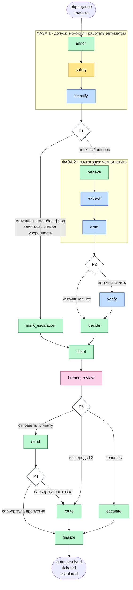
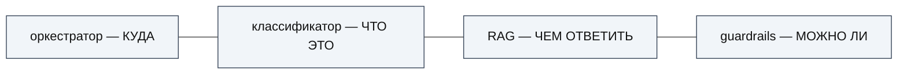
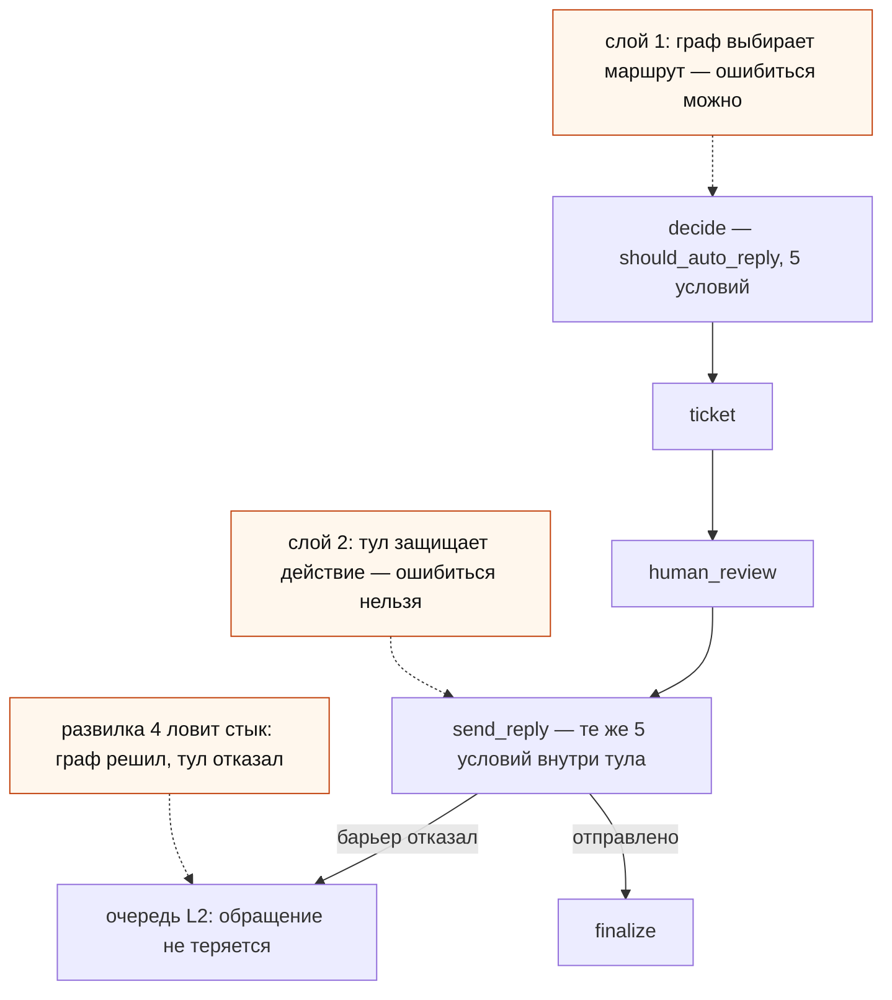
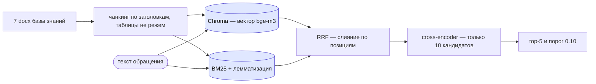
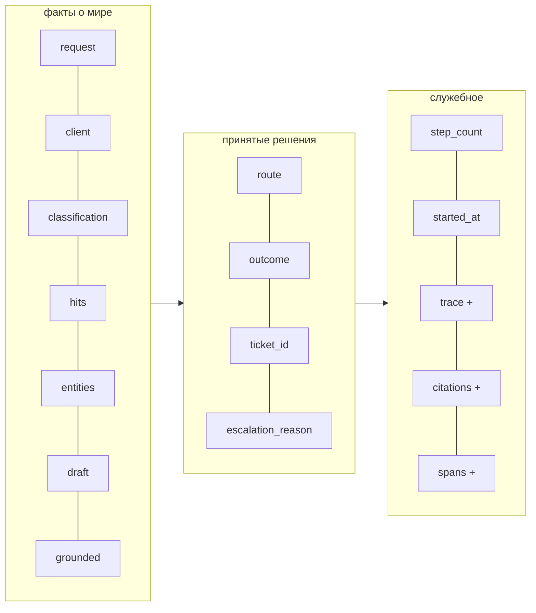
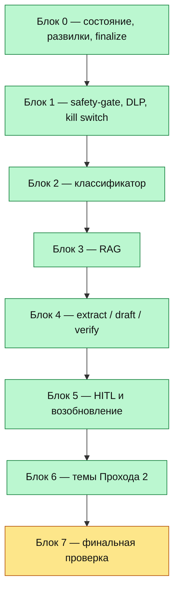

# Карта агента и разбора

Рабочая карта для обучающего прохода по проекту: что где лежит, как связано и
какой блок в каком состоянии. Архитектурные обоснования — в `Roadmap.md`,
код — в `bank_support_agent.ipynb`.

---

## 1. Граф агента

Читать так: **прямоугольник — узел** (делает работу и пишет результат в
состояние), **ромб — развилка** (только выбирает ветку, ничего не меняет),
**подпись на стрелке — условие**, при котором идём именно туда.

Обращение всегда входит слева сверху и всегда выходит одним из трёх исходов.
Тикет создаётся на любом пути — это требование ТЗ.

**Синие узлы вызывают модель** — только они стоят денег и времени и только они
могут выдумать. Их ровно четыре, и три из четырёх стоят на одной ветке подряд.
Жёлтый — барьер безопасности на регулярках, без модели вообще. Зелёные —
действия и записи решений. Розовый — единственная точка, где систему
останавливает человек.

### Что делает каждый узел

| узел | отвечает на вопрос | модель | заметка |
|---|---|---|---|
| `enrich` | кто этот клиент | — | CRM read-only; недоступна → работаем без профиля |
| `safety` | текст вообще безопасен | — | регулярки: инъекции, транслит, брань, язык, PII |
| `classify` | **что это** | ✅ | категория, подкатегория, сложность, тон, приоритет, уверенность |
| `mark_escalation` | почему к человеку | — | записывает причину, чтобы её было видно в трейсе |
| `retrieve` | **чем ответить** | — | гибридный поиск + реранкер, фильтр по продукту |
| `extract` | какие факты назвал клиент | ✅ | сумма, дата, карта — для оператора L2 |
| `draft` | как это звучит клиенту | ✅ | текст строго по найденным фрагментам |
| `verify` | ответ опирается на регламент | ✅ | **самый дорогой узел: 58.7 с** |
| `decide` | автоответ или очередь | — | записывает решение, исполнят его позже |
| `ticket` | зарегистрировано ли обращение | — | идемпотентно: повтор вернёт тот же тикет |
| `human_review` | что скажет оператор | — | настоящая пауза графа: `interrupt()` |
| `send` | **можно ли отправить** | — | 5 барьеров внутри тула, независимо от графа |
| `route` | в какую очередь и с каким SLA | — | |
| `escalate` | задача человеку заведена | — | |
| `finalize` | всё ли сошлось | — | 5 инвариантов, единая точка выхода |

### Три маршрута — по числу исходов

| исход | путь | цена |
|---|---|---|
| **escalated** | `enrich → safety → classify → Р1 → mark_escalation → ticket → human_review → escalate → finalize` | ~15 с: пропускает весь RAG и генерацию |
| **ticketed** | то же до `Р1`, дальше `retrieve → extract → draft → Р2 → decide → ticket → … → route → finalize` | ~75 с, если `Р2` пропустила `verify` |
| **auto_resolved** | полный путь через `verify` и `send` | ~130 с |

Развилка `Р2` — свежая (решение №105): она пропускает `verify`, когда
источников недостаточно, потому что при слабой поддержке автоответ невозможен
**при любом** ответе судьи. На замере это 7 обращений из 12.

---

## 2. Формула разделения ответственности

Дословно из ТЗ — на ней держится весь дизайн:

Каждый отвечает на один вопрос и не лезет в чужой. Классификатор не выбирает
маршрут, RAG не решает, отправлять ли ответ, guardrails не выбирают категорию.

---

## 3. Двойной барьер автоответа

Единственное необратимое действие агента — отправка ответа клиенту. Поэтому
одни и те же пять условий проверяются **дважды и независимо**.

Пять условий: `grounded`, `complexity == simple`, категория в allow-list,
достаточная поддержка источниками, `language_ok`.

---

## 4. RAG-конвейер

Вектор понимает смысл, BM25 — точные слова: номер тарифа, «СБП», номер счёта.
RRF сливает по местам в списке, а не по несопоставимым шкалам. Реранкер дорогой,
поэтому смотрит только на 10 отобранных, а не на всю базу.

---

## 5. Состояние: что течёт между узлами

Знак `+` — поля с редюсером `operator.add`: они **накапливаются**, а не
затираются. Без этого в конце прогона осталась бы одна последняя строка трейса,
и объяснять принятое решение было бы нечем.

---

## 6. Статус разбора

| блок | состояние | что найдено и починено |
|---|---|---|
| 0 · состояние и развилки | ✅ | пауза HITL входила в бюджет `MAX_SECONDS`: исход перезаписывался на `escalated` уже **после** отправки ответа клиенту (№101); удалено мёртвое поле `stagnation_hashes` (№102); коллизия имён тестов с агентом (№103) |
| 1 · safety-gate | ✅ | параметр `dlp_layer(channel=)` был декоративным — в канале логов DLP стирал бы запись о самом инциденте (№104) |
| 2 · классификатор | ✅ | macro-F1 66.5% → 89.9%, на holdout 74.3% → 84.0%; few-shot проверен и отвергнут как утечка (№109) |
| 3 · RAG | ✅ | `verify` работал впустую на 7 путях из 12 — новая развилка 2 (№105); два докстринга расходились с кодом (№108); `Protocol` не был проставлен типом |
| 4 · генеративные тулы | ✅ | числа сравнивались с точностью формата `%g` — «1 234 567» и выдуманное «1 234 566» считались одним числом; в базе знаний 8 таких величин (№110); дата «15.06.2026» давала ложное число «15.06» (№111) |
| 5 · HITL | ✅ | kill switch не закрывал путь через паузу: обращение, вставшее на `interrupt()` до отключения агента, отправляло ответ клиенту уже после того, как рубильник дёрнули — причём по согласованному оператором тексту, который проходит мимо всех пяти барьеров (№112) |
| 6 · Часть II | ✅ | проверено полным прогоном: Quality Gate — критические ворота PASS, инварианты маршрутизации 10/10, red-team FNR 0%, кэш 1 вызов + 4 попадания |
| 7 · финальная проверка | 🔄 сейчас | полный прогон **зелёный** (50 ячеек, 638 c), тесты **13/13**, мёртвого кода 0 из 160 определений; идёт сквозной перезамер на 20 обращениях |

Сквозной клинап по ходу: `MODEL_FAST` → `MODEL` (№106); девять формулировок в
будущем времени о том, что уже сделано или сознательно отброшено (№107).

---

## 7. Где что лежит

| файл | что это |
|---|---|
| `Roadmap.md` | требования, архитектура, журнал решений |
| `bank_support_agent.ipynb` | сам агент, 114 ячеек |
| `research_and_notes.ipynb` | замеры и разведка, приведшие к решениям журнала |
| `tests_tools.py` | 10 unit-тестов, запускаются отдельно от ноутбука |
| `prompts/<name>/vN.txt` | системные промпты, версионируются файлами |
| `bench/` | сохранённые результаты замеров; пять файлов читает код ноутбука |
| `README.md` | сжатое описание для сдачи в ЛМС |
| `architecture_map.md` | этот файл |
